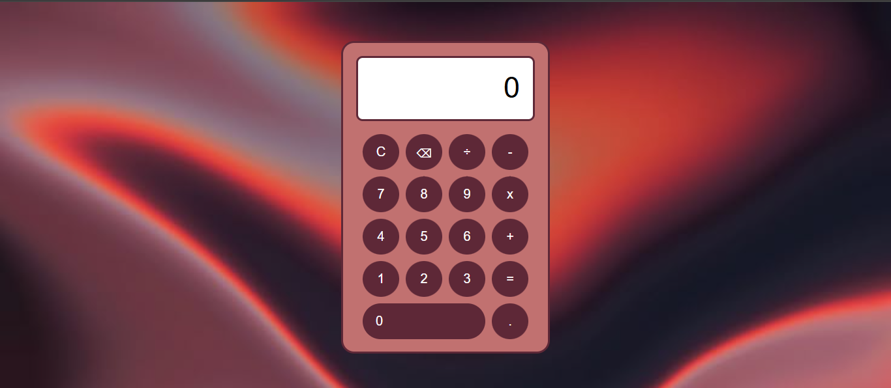

# simple-calculator
Este é um projeto de uma calculadora simples feito com **HTML, CSS e JavaScript**, com foco no apredizado.

## Funcionalidades
- Soma, Subtração, Multiplicação e Divisão
- Botão de limpar (`C`)
- Botão de apagar último caractere (`⌫`)
- Interface com layout responsivo
- Operações com vários dígitos

## Screenshot
Veja como a interface da calculadora ficou: 

